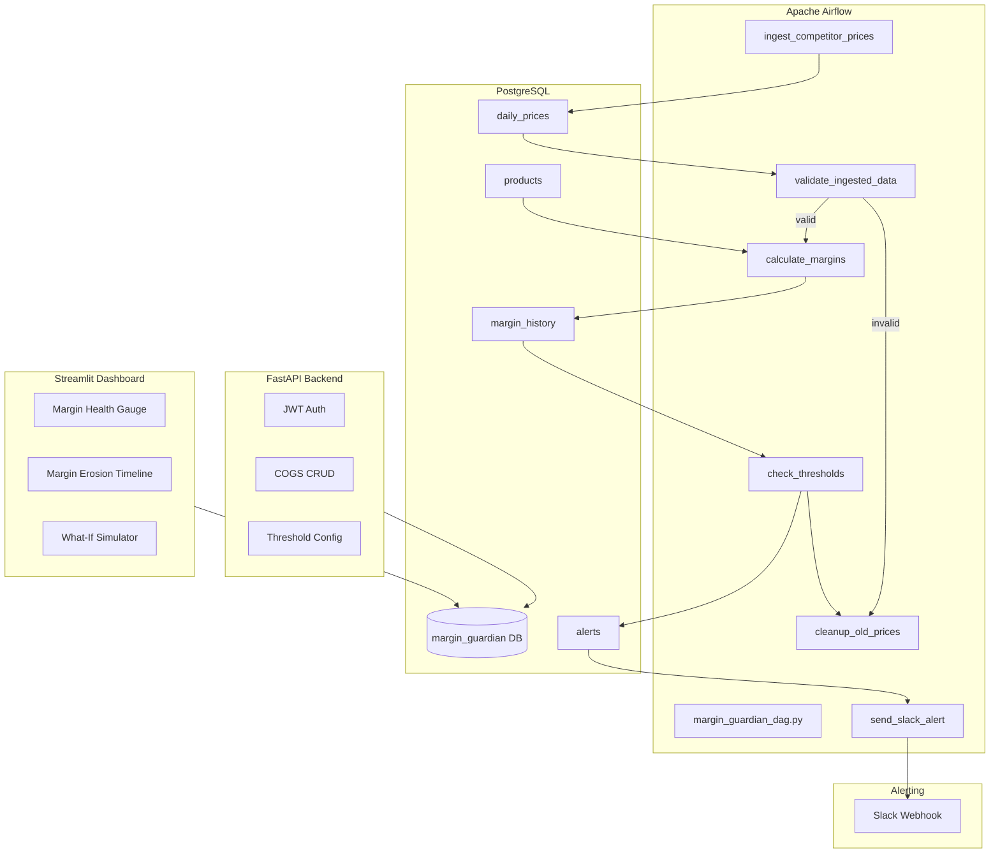

# Kinz Margin Guardian Pipeline

> An automated data engineering pipeline that tracks KINZ product COGS, ingests simulated daily competitor pricing, calculates real-time B2B and B2C profit margins, and triggers Slack/Email alerts when margins drop below critical thresholds.

---

## Table of Contents

1. [Architecture](#architecture)
2. [Tech Stack](#tech-stack)
3. [Repository Structure](#repository-structure)
4. [Quick Start](#quick-start)
5. [Airflow DAG](#airflow-dag)
6. [FastAPI Backend](#fastapi-backend)
7. [Streamlit Dashboard](#streamlit-dashboard)
8. [What-If Simulator](#what-if-simulator)
9. [Security](#security)
10. [CI/CD](#cicd)

---

## Architecture



---

## Tech Stack

| Layer          | Technology                                    |
|----------------|-----------------------------------------------|
| Orchestration  | Apache Airflow 2.9 (containerized)            |
| Database       | PostgreSQL 16                                 |
| Backend API    | FastAPI + SQLAlchemy + JWT (PyJWT)            |
| Dashboard      | Streamlit + Plotly                            |
| DevOps         | Docker Compose, GitHub Actions                |
| Testing        | pytest                                        |

---

## Repository Structure

```
kinz-margin-guardian-pipeline/
├── README.md
├── SECURITY.md
├── LICENSE
├── .env.example
├── .gitignore
├── docker-compose.yml
├── Makefile
├── requirements.txt
│
├── .github/workflows/ci.yml
│
├── airflow/
│   ├── dags/
│   │   └── margin_guardian_dag.py
│   └── plugins/
│       └── margin_operators.py
│
├── api/
│   ├── main.py
│   ├── auth.py
│   ├── models.py
│   ├── database.py
│   ├── Dockerfile
│   └── routes/
│       ├── products.py
│       ├── thresholds.py
│       └── alerts.py
│
├── dashboard/
│   ├── app.py
│   └── Dockerfile
│
├── analytics/
│   └── margin_risk_analysis.ipynb
│
├── scripts/
│   ├── init_db.sql
│   ├── seed_products.py
│   └── simulate_competitor_prices.py
│
├── src/
│   ├── __init__.py
│   ├── margin_engine.py
│   ├── alert_manager.py
│   └── config.py
│
├── tests/
│   ├── test_margin_engine.py
│   └── test_alert_manager.py
│
└── .streamlit/config.toml
```

---

## Quick Start

### Prerequisites

- Docker 24+ and Docker Compose v2
- 4GB+ RAM (Airflow + Postgres + API + Streamlit)

### One-command spin-up

```bash
git clone https://github.com/nassim0014/kinz-margin-guardian-pipeline.git
cd kinz-margin-guardian-pipeline
cp .env.example .env
# Edit .env with your Slack webhook URL + JWT secret
docker compose up --build -d
```

### Access the services

| Service          | URL                          | Default Login         |
|------------------|------------------------------|-----------------------|
| Airflow UI       | http://localhost:8080        | admin / admin         |
| FastAPI Docs     | http://localhost:8000/docs   | JWT required          |
| Streamlit        | http://localhost:8501        | No auth (internal)    |
| PostgreSQL       | localhost:5432 (internal)    | kinz_guardian / .env  |

### Initialize the database

```bash
docker compose exec postgres psql -U kinz_guardian -d margin_guardian -f /docker-entrypoint-initdb.d/init_db.sql
docker compose exec api python scripts/seed_products.py
```

---

## Airflow DAG

**File:** `airflow/dags/margin_guardian_dag.py`
**Schedule:** `0 6 * * *` (daily at 06:00 UTC = 07:00 Africa/Tunis)

### Tasks

| Task | Operator | Purpose |
|------|----------|---------|
| `ingest_competitor_prices` | PythonOperator | Simulates fetching daily competitor prices (±5% noise) |
| `validate_ingested_data` | ShortCircuitOperator | Validates `competitor_price > 0` and `cogs > 0`; skips downstream if invalid |
| `calculate_margins` | PythonOperator | Computes B2B (price × 0.85) and B2C margins per product |
| `check_thresholds` | PythonOperator | Checks if margin < threshold (default 40%) per product |
| `send_slack_alert` | PythonOperator | Sends formatted Slack message if any alerts triggered |
| `cleanup_old_prices` | PythonOperator | Deletes daily_prices older than 90 days |

### Margin Formula

```
B2C Price  = Competitor price
B2B Price  = Competitor price × 0.85 (15% B2B discount)

B2C Margin % = (B2C Price - COGS) / B2C Price × 100
B2B Margin % = (B2B Price - COGS) / B2B Price × 100

If margin < threshold → trigger alert
```

---

## FastAPI Backend

**File:** `api/main.py`
**Port:** 8000
**Docs:** http://localhost:8000/docs

### Endpoints

| Method | Path | Auth | Description |
|--------|------|------|-------------|
| POST | `/auth/token` | — | Login → get JWT token |
| GET | `/products` | JWT | List all products + COGS |
| POST | `/products` | JWT | Create a new product |
| PUT | `/products/{id}` | JWT | Update product COGS or price |
| DELETE | `/products/{id}` | JWT | Deactivate a product |
| GET | `/thresholds` | JWT | List alert thresholds per product |
| PUT | `/thresholds/{product_id}` | JWT | Update threshold for a product |
| GET | `/alerts` | JWT | View alert history |
| GET | `/margins/latest` | JWT | Get latest margins for all products |

---

## Streamlit Dashboard

**File:** `dashboard/app.py`
**Port:** 8501

### Features

1. **Margin Health Gauge** — Plotly gauge indicator per product (red <30%, amber 30-40%, green >40%)
2. **Margin Erosion Timeline** — Time-series line chart of B2B + B2C margins
3. **Alert Log Table** — Sortable history of all triggered alerts
4. **Product Comparison** — Bar chart comparing current margins across all products
5. **COGS vs Price Scatter** — Scatter plot with margin % as bubble size

---

## What-If Simulator

The dashboard includes a **"🔮 What-If Simulator"** tab that lets business stakeholders:

1. Select a product from a dropdown
2. Adjust COGS via a slider (±20%)
3. Adjust competitor price via a slider (±30%)
4. Instantly see recalculated B2B and B2C margins on Plotly gauges
5. See whether the new scenario would trigger an alert

This provides interactive decision-support for pricing and procurement decisions.

---

## Security

See [SECURITY.md](SECURITY.md) for the full security policy.

Key controls:
- Database credentials in `.env` (gitignored)
- JWT auth on all API endpoints (60-min expiry, HS256)
- Slack webhook URL stored as env var, never logged
- Postgres not exposed to host (internal Docker network)
- SQLAlchemy ORM (parameterized queries — no SQL injection)
- Pydantic input validation on all API payloads

---

## CI/CD

GitHub Actions workflow (`.github/workflows/ci.yml`):
- Python 3.11 + 3.12 matrix
- Syntax check all `.py` files
- pytest unit tests
- Docker build smoke test

---

## License

MIT — see [LICENSE](LICENSE).
